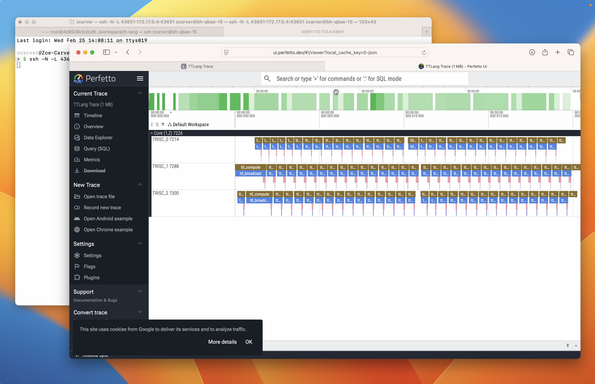

# Performance Tools

TT-Lang provides built-in performance analysis tools for profiling kernels on Tenstorrent hardware. All tools are activated via environment variables and print results after kernel execution.

## Using Claude for Performance Analysis

The `/ttl-profile` and `/ttl-optimize` [Claude Code](https://claude.com/claude-code) skills are designed to work with these tools. Claude knows about all of the performance tools documented here and can walk you through adding signposts, running the profiler, interpreting perf dumps, and optimizing your kernels. See the [Claude Skills](../claude-skills.md) page for setup instructions.

## Environment Variables

| Variable | Description |
|---|---|
| `TT_METAL_HOME` | Path to tt-metal (required for all profiling) |
| `TT_METAL_DEVICE_PROFILER=1` | Enable device profiler (required for all profiling) |
| `TT_METAL_PROFILER_MID_RUN_DUMP=1` | Enable mid-run profiler dumps (required for all profiling) |
| `TT_METAL_DEVICE_PROFILER_NOC_EVENTS=1` | Enable NOC event tracing (required for perf summary) |
| `TTLANG_PERF_DUMP=1` | Print NOC traffic and per-thread wall time summary |
| `TTLANG_AUTO_PROFILE=1` | Instrument every line with signposts and print per-line cycle counts |
| `TTLANG_SIGNPOST_PROFILE=1` | Print cycle counts for user-defined `ttl.signpost()` regions |
| `TTLANG_PERF_SERV=1` | Serve profiler data as a Perfetto trace after execution |

**Valid combinations:**

- `TTLANG_PERF_DUMP` can be used standalone or alongside either profiler.
- `TTLANG_AUTO_PROFILE` and `TTLANG_SIGNPOST_PROFILE` must be used independently (not together). Auto-profiling instruments every line automatically; signpost profiling only measures user-annotated regions.
- `TTLANG_PERF_SERV` can be combined with either `TTLANG_AUTO_PROFILE` or `TTLANG_SIGNPOST_PROFILE` to visualize results in Perfetto.

## Perf Summary

Set `TTLANG_PERF_DUMP=1` to print a NOC traffic and per-thread wall time summary after kernel execution.

**Required environment variables** (must be exported before running):
```bash
export TT_METAL_HOME=/path/to/tt-metal
export TT_METAL_DEVICE_PROFILER=1
export TT_METAL_DEVICE_PROFILER_NOC_EVENTS=1
export TT_METAL_PROFILER_MID_RUN_DUMP=1
export TTLANG_PERF_DUMP=1
python path/to/program.py  # just run with python
```

**Sample output:**
```
--- Program 1024 (__demo_kernel) ---
grid: 1x1 (1 nodes)
duration: 2,225,436 cycles (1.65 ms)
  DRAM read:          5.4 MB  (2790 transfers)
  DRAM write:         5.0 MB  (2582 transfers)
  effective BW:   6.7 GB/s (total payload / duration)
  transfer size:  2.0 KB (uniform)
  barriers:       57 read (1 per 49 reads), 161 write (1 per 16 writes)
  noc reads:      NOC_0=2790
  noc writes:     NOC_1=2582
  DRAM channels:  16
  kernel time:
    BRISC    2,225,356 cycles (1.65 ms)
    NCRISC   2,211,871 cycles (1.64 ms)
    TRISC_0  2,222,025 cycles (1.65 ms)
    TRISC_1  2,222,876 cycles (1.65 ms)
    TRISC_2  2,222,358 cycles (1.65 ms)
```

### Standalone usage

The perf summary tool can also be run standalone against previously collected profiler logs. This works with any tt-metal program, not just tt-lang kernels -- it parses the same NOC trace JSON and device profiler CSV that tt-metal's profiling infrastructure produces.

```bash
# Default: reads from $TT_METAL_HOME/generated/profiler/.logs/
python -m ttl._src.perf_summary

# Custom path
python -m ttl._src.perf_summary --path /path/to/profiler/.logs/

# Machine-readable JSON output
python -m ttl._src.perf_summary --path /path/to/profiler/.logs/ --json

# Filter to specific kernel names
python -m ttl._src.perf_summary --names "my_kernel,ttnn.multiply"
```

## Auto-Profiling

TT-Lang includes built-in auto-profiling that instruments kernels with signposts and generates per-line cycle count reports.

**Required environment variables** (must be exported before running):
```bash
export TT_METAL_HOME=/path/to/tt-metal
export TT_METAL_DEVICE_PROFILER=1
export TT_METAL_PROFILER_MID_RUN_DUMP=1
export TTLANG_AUTO_PROFILE=1
```

**Example:**
```bash
export TT_METAL_HOME=/workspace/tt-mlir/third_party/tt-metal/src/tt-metal
export TT_METAL_DEVICE_PROFILER=1
export TT_METAL_PROFILER_MID_RUN_DUMP=1
export TTLANG_AUTO_PROFILE=1
python examples/tutorial/multinode_grid_auto.py
```

**Sample output:**
```
====================================================================================================
THREAD: NCRISC     [demo_read] (8000 ops, 160,260 cycles, 100.0% of total)
====================================================================================================

LINE   %TIME   CYCLES     SOURCE
------ ------- ---------- ----------------------------------------------------------------------
105                       def demo_read():
106      2.5%  18-50          core_x, core_y = ttl.node(dims=2)  (x192, avg=21.3, total=4,086)
108                           for core_row in range(rows_per_core):
109      3.7%  18-49              row = core_x * rows_per_core + core_row  (x256, avg=23.4, total=5,996)
110      3.4%  18-41              start_row_tile = row * row_tiles_per_block  (x256, avg=21.6, total=5,517)
111      5.1%  18-60              end_row_tile = (row + 1) * row_tiles_per_block  (x384, avg=21.1, total=8,109)
113                               for core_col in range(cols_per_core):
114      6.5%  18-49                  col = core_y * cols_per_core + core_col  (x512, avg=20.2, total=10,349)
115      6.7%  18-43                  start_col_tile = col * col_tiles_per_block  (x512, avg=20.8, total=10,669)
116      6.8%  18-55                  end_col_tile = (col + 1) * col_tiles_per_block  (x512, avg=21.2, total=10,863)
118                                   with (
119     11.3%  18,068                     a_cb.reserve() as a_blk,
                                                                   ├─ 10,162 cb_reserve (x512)
                                                                   ╰─ 7,906 cb_push (implicit) (x384)
```

See [auto-profiler-examples/](auto-profiler-examples/) for more complete sample outputs.

> **Warning:** Each node supports only 125 signposts. Kernels with many operations in tight loops may overflow this buffer, causing later signposts to be silently dropped and mismatched cycle counts. See [#268](https://github.com/tenstorrent/tt-lang/issues/268) for details.

## User-Defined Signposts

Use `ttl.signpost("name")` as a context manager to measure cycle counts for targeted code blocks instead of every line. This is useful when you only care about specific regions, or when auto-profiling overflows the signpost buffer.

Signposts and auto-profiling must be used independently. If both are enabled, user signposts are skipped with a warning.

**Important:** Each node supports only 125 signposts. To avoid overflowing the signpost buffer, update your kernel to run only one iteration when profiling. Watch for warnings about buffer overflow in the output.

**Required environment variables:**
```bash
export TT_METAL_HOME=/path/to/tt-metal
export TT_METAL_DEVICE_PROFILER=1
export TT_METAL_PROFILER_MID_RUN_DUMP=1
export TTLANG_SIGNPOST_PROFILE=1
```

### Example

**Input program:**
```python
@ttl.compute()
def demo_compute():
    with c_dfb.wait() as c_blk:
        for _ in range(rows):
            for _ in range(cols):
                with (
                    a_dfb.wait() as a_blk,
                    b_dfb.wait() as b_blk,
                    y_dfb.reserve() as y_blk,
                ):
                    with ttl.signpost("compute"):
                        with ttl.signpost("broadcast"):
                            a_bcast = ttl.math.broadcast(a_blk, y_blk, dims=[1])
                            b_bcast = ttl.math.broadcast(b_blk, y_blk, dims=[0])
                            c_bcast = ttl.math.broadcast(c_blk, y_blk, dims=[0, 1])
                            with ttl.signpost("math"):
                                tmp = a_bcast * b_bcast + c_bcast
                                with ttl.signpost("store"):
                                    y_blk.store(tmp)
```

**Generated C++ (compute kernel):**
```cpp
for (size_t k10 = v6; k10 < v4; k10 += v5) {
        for (size_t l11 = v6; l11 < v4; l11 += v5) {
          tile_regs_acquire();
          {
          DeviceZoneScopedN("ttl_compute");
          {
          DeviceZoneScopedN("ttl_broadcast");
          unary_bcast_init<BroadcastType::COL>(get_compile_time_arg_val(0), get_compile_time_arg_val(3));
          unary_bcast<BroadcastType::COL>(get_compile_time_arg_val(0), k10, v6);
          unary_bcast_init<BroadcastType::ROW>(get_compile_time_arg_val(1), get_compile_time_arg_val(3));
          unary_bcast<BroadcastType::ROW>(get_compile_time_arg_val(1), l11, v5);
          mul_binary_tile_init();
          mul_binary_tile(v6, v5, v6);
          unary_bcast_init<BroadcastType::SCALAR>(get_compile_time_arg_val(2), get_compile_time_arg_val(3));
          unary_bcast<BroadcastType::SCALAR>(get_compile_time_arg_val(2), v6, v5);
          {
          DeviceZoneScopedN("ttl_math");
          add_binary_tile_init();
          add_binary_tile(v6, v5, v6);
          {
          DeviceZoneScopedN("ttl_store");
          tile_regs_commit();
          tile_regs_wait();
          size_t v12 = k10 * v4;
          size_t v13 = v12 + l11;
          pack_tile<true>(v6, get_compile_time_arg_val(3), v13);
          }
          }
          }
          }
          tile_regs_release();
        }
      }
```

**Results:**
```
================================================================================
SIGNPOST PROFILE
================================================================================

  NAME        THREAD        COUNT        TOTAL        AVG        MIN        MAX
  ----------- ------------ ------ ------------ ---------- ---------- ----------
  store       TRISC_0          31          616         19         18         28
  math        TRISC_0          31        2,232         72         62         80
  broadcast   TRISC_0          31       21,005        677        517        806
  compute     TRISC_0          32       23,265        727        568        856
  store       TRISC_1          31        1,036         33         32         43
  math        TRISC_1          31        6,279        202        198        215
  broadcast   TRISC_1          31       24,436        788        719      2,535
  compute     TRISC_1          32       26,458        826        676      2,575
  store       TRISC_2          31        1,952         62         61         67
  math        TRISC_2          31        3,641        117        106        125
  broadcast   TRISC_2          31       22,881        738        585      2,171
  compute     TRISC_2          32       25,250        789        641      2,222
```

Signposts can be nested as shown above. The report breaks down cycle counts per signpost region per hardware thread, showing count, total, average, min, and max cycles.

## Perfetto Trace Server

Set `TTLANG_PERF_SERV=1` to serve profiler data as a [Perfetto](https://perfetto.dev/) trace after kernel execution. This works with both auto-profiling and signpost profiling. The server converts the device profiler CSV to Chrome Trace Event format and opens it in the Perfetto UI.



**Required environment variables:**
```bash
# Setup:
export TT_METAL_DEVICE_PROFILER=1
export TT_METAL_PROFILER_MID_RUN_DUMP=1

# With signpost profiling:
export TTLANG_SIGNPOST_PROFILE=1
export TTLANG_PERF_SERV=1
python path/to/program.py

# Or with auto-profiling:
export TTLANG_AUTO_PROFILE=1
export TTLANG_PERF_SERV=1
python path/to/program.py
```

After kernel execution, the server starts and prints connection instructions:

```
======================================================================
TTLANG PERFETTO TRACE SERVER
======================================================================
  419 trace events ready
  Serving on port 48019

  From your local machine, run:
    ssh -N -L 48019:172.17.0.2:48019 user@<server>

  Then open:
    http://localhost:48019

  Press Enter to stop the server...
======================================================================
```

If running directly on the server or inside a Docker container, use the SSH tunnel command shown in the output to forward the port to your local machine. On a local machine, open the URL directly.

### Standalone usage

The server can also be run standalone against previously collected profiler logs. Like the perf summary tool, this works with any tt-metal program -- it parses the standard `profile_log_device.csv` that tt-metal's profiling infrastructure produces.

```bash
python -m ttl._src.perf_trace_server --path /path/to/profiler/.logs/
```
